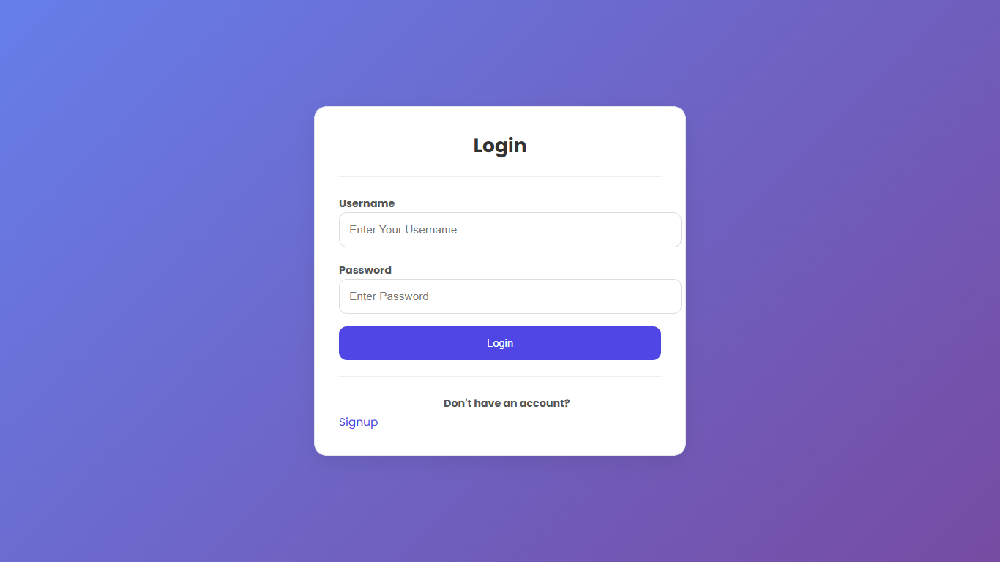
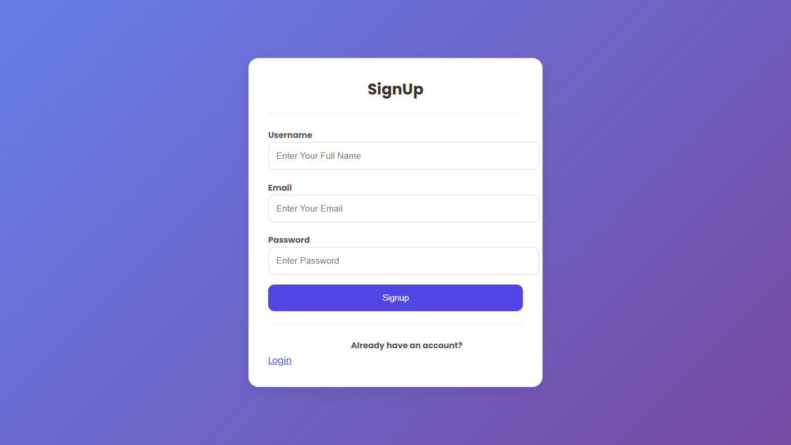
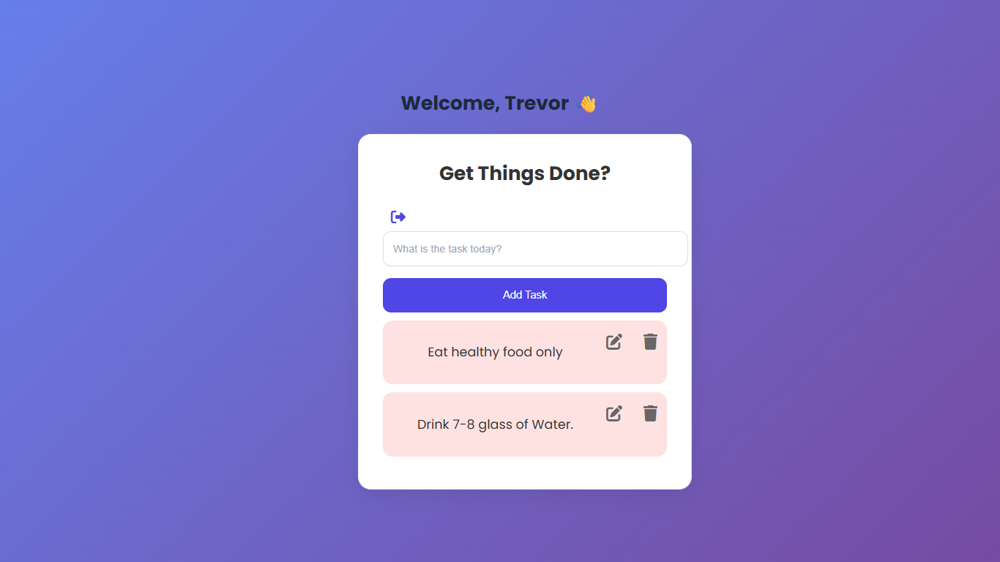

# 📝 Django Todo App

A simple and user-friendly Todo application built using Django. This project allows users to manage daily tasks efficiently with features like adding, editing, and deleting tasks.

---

## 🚀 Features

* ➕ Add new tasks
* ✏️ Edit existing tasks
* 🗑️ Delete tasks
* ✅ Mark tasks as completed
* 🔐 User Authentication (Login & Signup)
* 🎨 Clean and modern UI

---

## 🛠️ Tech Stack

* **Backend:** Django (Python)
* **Frontend:** HTML, CSS
* **Database:** SQLite
* **Deployment:** Render
* **Version Control:** Git & GitHub

---

## 📂 Project Structure

```
Todo_App/
│── todo/              # Main project folder
│── myapp/             # Application logic (models, views)
│── templates/         # HTML files
│── static/            # CSS, JS files
│── db.sqlite3         # Database
│── manage.py
```

---

## ⚙️ Installation & Setup

Follow these steps to run the project locally:

### 1️⃣ Clone the repository

```bash
git clone https://github.com/Jain0512/Todo_App.git
cd Todo_App
```

---

### 2️⃣ Create virtual environment

```bash
python -m venv venv
```

Activate it:

* Windows:

```bash
venv\Scripts\activate
```

---

### 3️⃣ Install dependencies

```bash
pip install -r requirements.txt
```

---

### 4️⃣ Run migrations

```bash
python manage.py migrate
```

---

### 5️⃣ Run the server

```bash
python manage.py runserver
```

---

### 6️⃣ Open in browser

```
http://127.0.0.1:8000/
```

---

## 🌐 Live Demo

👉 https://todo-app-9c28.onrender.com


---

## 📸 Screenshots

### 🔐 Login Page


### 📝 Signup Page


### ✅ Todo Dashboard


---

## 💡 Future Improvements

* Add task search functionality
* Add priority levels (High, Medium, Low)
* Add due dates
* Improve UI with animations
* Implement checkbox toggle for tasks

---

## 👨‍💻 Author

**Sanyam Jain**

* GitHub: https://github.com/Jain0512

---

## ⭐ Show Your Support

If you like this project, give it a ⭐ on GitHub!
